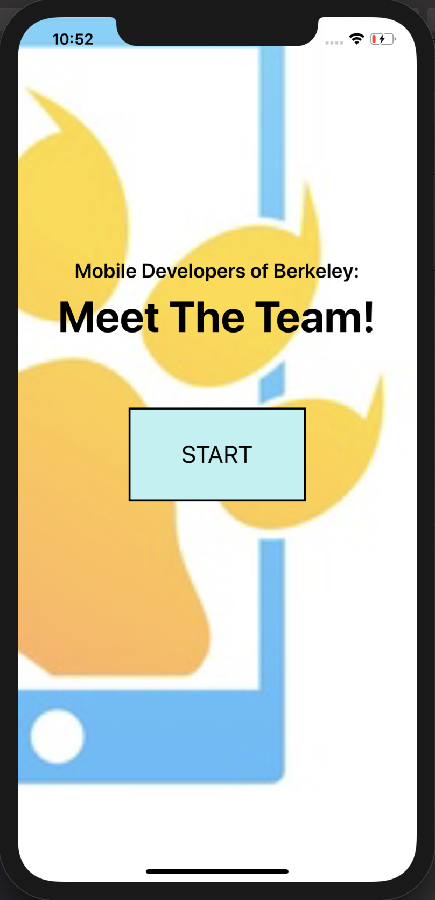
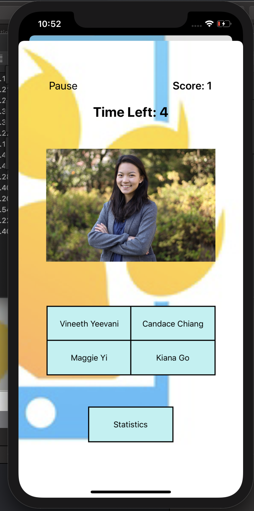
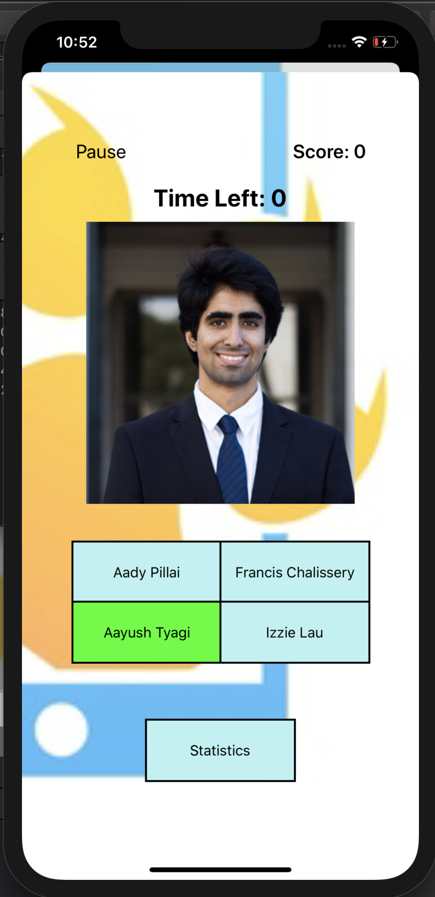
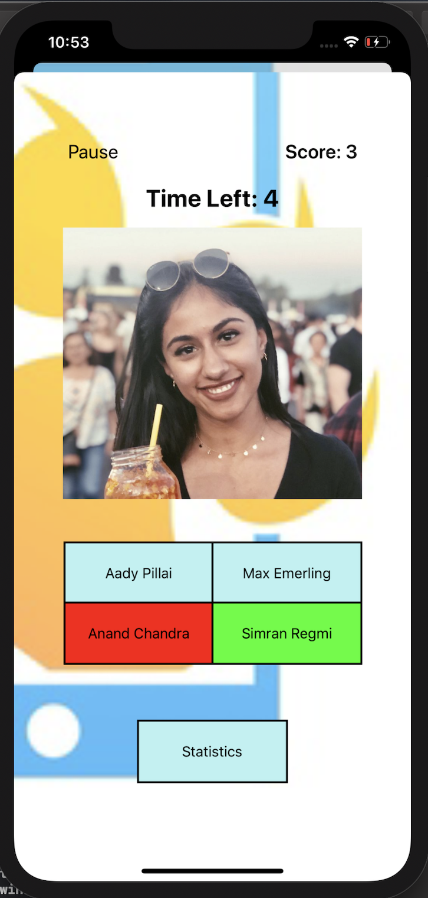

# Match-the-Members
Match the Members is an iOS application created for the Mobile Developers of Berkeley training program. It is a game that helps newbies learn the names of old members by matching members' pictures with their names in a multiple choice fashion. The object of the game is to obtain as high of a score you can. There is also a statistics page that records your longest streak as well as the answers of the previous 3 questions.

<h1>Main Menu Screen:</h1> 

  
<h1>Game Selection Screen:</h1> 

  
<h1>Running out of time when playing:</h1> 

  
<h1>Game Screen when you select member correctly:</h1> 

  
<h1>Statistics Screen that tracks previous progress:</h1> 

